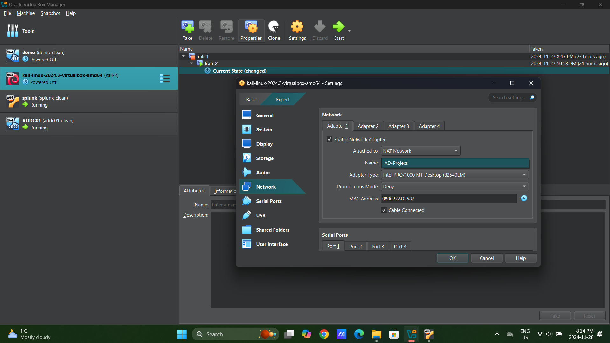
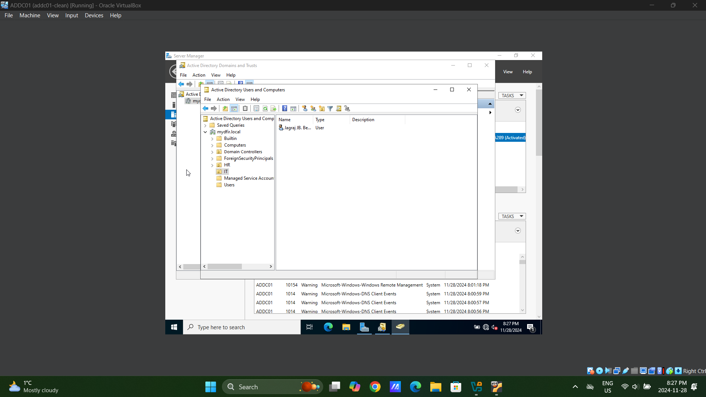

# Active Directory and Security Monitoring Lab

## Objective

I set up this lab to explore how to secure and monitor Active Directory environments. The goal was to create a networked setup with four virtual machines (VMs), simulate a credential-based attack, and analyze the resulting logs using Splunk. This hands-on project gave me insights into Active Directory management, attack detection, and log monitoring.

## Tools Used

- **VirtualBox**: Used to host and manage the virtual machines.
- **Windows Server 2022**: Configured as the Active Directory Domain Controller (VM1).
- **Splunk Server**: Used to collect and analyze event logs (VM2).
- **Kali Linux**: Used to simulate attacks (VM3).
- **Additional Clean VM**: Used for testing, including logging in as the compromised `jbenipal` user (VM4).

## Steps

### Step 1: Setting Up the Virtual Network

The first step was creating a virtual NAT network to connect all four VMs. I configured the network so the Domain Controller, Splunk server, Kali Linux machine, and the additional clean VM could communicate seamlessly. This setup created a realistic environment for simulating attacks and analyzing logs.

  
_The VirtualBox setup showing the four VMs connected to the "AD-Project" NAT network._

---

### Step 2: Configuring Active Directory

I installed and configured Active Directory on the Domain Controller (VM1). I created a new domain, `myfir.local`, and set up organizational units like HR and IT to mirror a realistic corporate structure. I also added a test user, `jbenipal`, under the HR unit to simulate an employee account.

