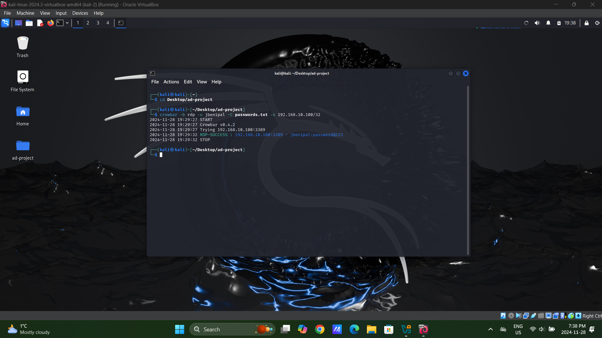
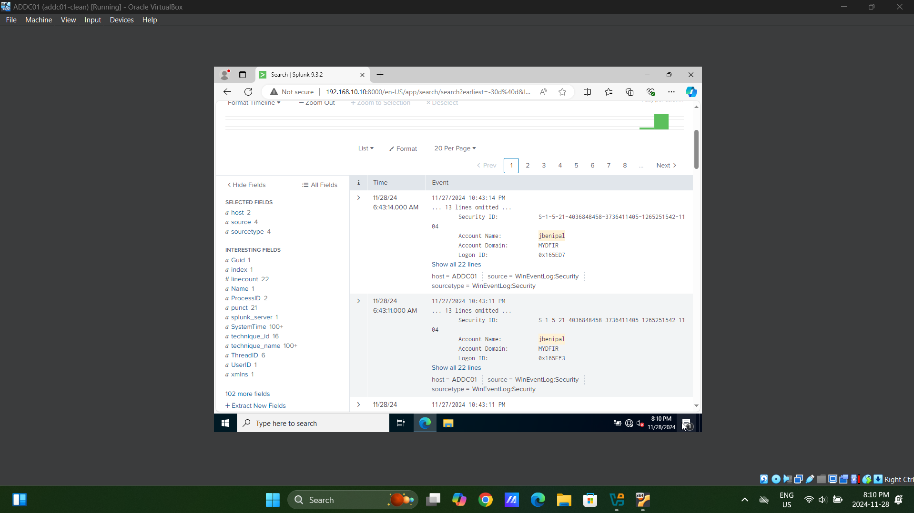

# Active Directory and Security Monitoring Lab

## Objective

I set up this lab to explore how to secure and monitor Active Directory environments. The goal was to create a networked setup with four virtual machines (VMs), simulate a credential-based attack, and analyze the resulting logs using Splunk. This hands-on project gave me insights into Active Directory management, attack detection, and log monitoring.

## Tools Used

- **VirtualBox**: Used to host and manage the virtual machines.
- **Windows Server 2022**: Configured as the Active Directory Domain Controller (VM1).
- **Splunk Server**: Used to collect and analyze event logs (VM2).
- **Kali Linux**: Used to simulate attacks (VM3).
- **Additional Clean VM**: Used for testing, including logging in as the compromised `jbenipal` user (VM4).

## Steps

### Step 1: Setting Up the Virtual Network

The first step was creating a virtual NAT network to connect all four VMs. I configured the network so the Domain Controller, Splunk server, Kali Linux machine, and the additional clean VM could communicate seamlessly. This setup created a realistic environment for simulating attacks and analyzing logs.

  
_The VirtualBox setup showing the four VMs connected to the "AD-Project" NAT network._

---

### Step 2: Configuring Active Directory

I installed and configured Active Directory on the Domain Controller (VM1). I created a new domain, `myfir.local`, and set up organizational units like HR and IT to mirror a realistic corporate structure. I also added a test user, `jbenipal`, under the HR unit to simulate an employee account.

  
_Active Directory Users and Computers showing the user `jbenipal` added to the HR organizational unit._

---

### Step 3: Simulating an RDP Brute-Force Attack

With the environment set up, I used the Kali Linux VM (VM3) to simulate a brute-force attack using the `Crowbar` tool. The attack targeted the Domain Controller and successfully compromised the `jbenipal` account, revealing the password `password123`. This exercise demonstrated how weak credentials can be exploited by attackers.

  
_The screenshot shows the successful brute-force attack on the `jbenipal` account._

---

### Step 4: Logging in as `jbenipal` on a Clean VM

To simulate further activity, I logged in as the compromised user `jbenipal` on the additional clean VM (VM4). This step helped verify the account’s functionality and added logs to the system for further analysis.

---

### Step 5: Analyzing Logs with Splunk

To understand the attack better, I configured Splunk (VM2) to collect security event logs from the Domain Controller. Using Splunk's powerful search capabilities, I traced the attack and analyzed logon events for the compromised `jbenipal` account. This highlighted the importance of centralized logging and monitoring for detecting suspicious activity.

  
_Splunk search results showing the security logs for the compromised `jbenipal` account._

---

## Conclusion

This project was a great learning experience. Setting up and managing a multi-VM environment, simulating a credential-based attack, and using Splunk for log analysis helped me better understand how to detect and respond to security incidents. Logging in as the compromised user added realism to the simulation, reinforcing the importance of strong credentials and proactive monitoring in protecting critical systems.
